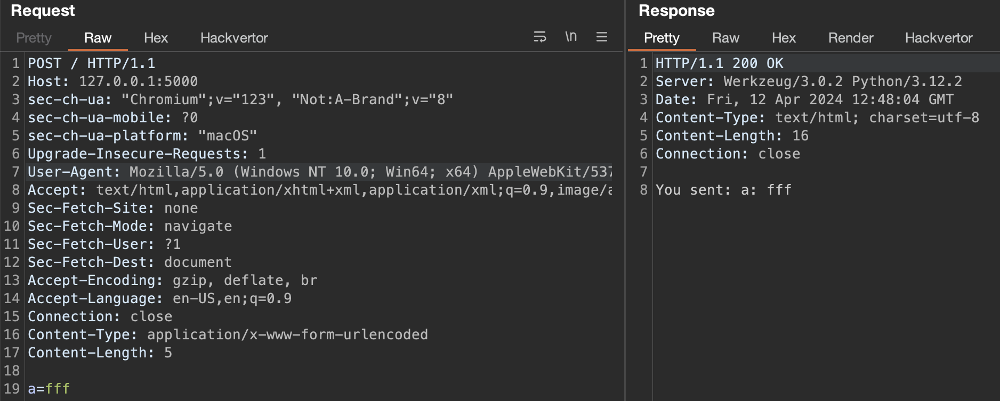

# Burp Repeater

Burp Repeater allows you to manually manipulate and modify HTTP requests and analyze their responses. Similar to Burp Intruder,
there is no golden recipe for successfully finding bugs when using Burp Repeater—it depends on the target and an
operator’s skill in identifying web app vulnerabilities.

## Use

Before proceeding, get familiar with the
[Reissue request with Burp Repeater](https://portswigger.net/burp/documentation/desktop/getting-started/reissuing-http-requests)
chapter in the official documentation.

## Set up a keyboard shortcut to issue requests

To streamline the testing process, Burp Suite allows you to set up a keyboard shortcut for issuing requests in Burp Repeater.
This minimizes the need to manually click the **Send** button each time, making testing more efficient and reducing repetitive
actions. Assign the **Issue Repeater request** to **Ctrl+R** in [**Hotkey** settings](https://portswigger.net/burp/documentation/desktop/settings/ui/hotkeys).

## Sending requests to Burp Scanner

When you interact with your application, make a habit of sending requests to Burp Scanner. Even if it’s a small change
in your request, sending it to Burp Scanner increases the chances of identifying a bug.

To send a request to Burp Scanner from Burp Repeater, follow these steps:

1. Right-click on the request.
2. From the context menu that appears, select the **Scan** option.
3. Choose **Audit coverage - maximum** to conduct the most comprehensive scan possible (for more information, see [Built-in configurations](https://portswigger.net/burp/documentation/scanner/scan-configurations/burp-scanner-built-in-configs)).
4. Click on **OK**.


You can set up a hot key for an active scan of the opened request. However, Burp Scanner will use its default configuration
to audit the request (contrary to the **Audit coverage - maximum** setup when manually clicking). Assign the **Do active scan**
in [**Hotkey** settings](https://portswigger.net/burp/documentation/desktop/settings/ui/hotkeys).


The active Burp Scanner will then automatically analyze the request, probing for
potential vulnerabilities and security issues.

Remember to look in underlying logs when you send a request to Burp Scanner. Learn more in the
<mandy>[Ensure your app handling works correctly]() section.

## Useful extensions

When sending requests in Burp Repeater, we advise you to use the following extensions:

1. [Taborator](https://portswigger.net/bappstore/c9c37e424a744aa08866652f63ee9e0f) will allow you to use `$collabplz`
in Burp Repeater. The `$collabplz` placeholder will be replaced with
a Burp Collaborator payload. You will notice in the **Taborator** tab whether Burp Collaborator identifies any connections.
2. [Hackvertor](https://portswigger.net/bappstore/65033cbd2c344fbabe57ac060b5dd100) is a tag-based conversion extension
that supports various escapes and encodings.
For example, you can conveniently use `<@base64>AAA<@/base64>` to Base64-encode input when sending it in Burp Repeater.

## Auto-scroll

When you manually try to bypass server-side sanitization, use **Auto-scroll to match when text changes** and add custom text both
in your payload and in the search form:


An example payload in a request with the `test1337` placeholder



The auto-scroll configuration to match when the `test1337` placeholder appears in a response


This way, whenever you tinker with a specific payload (e.g., trying different special characters),
you will be immediately scrolled to where the payload is reflected in the response.

## Show response in the browser

When you edit and send requests, you may want to see the output in the real browser (remember that the engine that displays
an HTTP response in the **Render** tab is limited). Also, to obtain the desired results, copying a URL and pasting it in
the browser is usually not enough. Copying the request to the intercepted request is not convenient either. What’s more,
sometimes a response appears only once or is hard to reproduce.

To show the response in the browser, right-click on the specific response, select **Show response in browser**, and paste
the produced URL in the browser that is proxied through Burp. The [original documentation](https://portswigger.net/burp/documentation/desktop/tools/message-editor#:~:text=Show%20response%20in%20browser)
states the following:
> *When you select this option, Burp gives you a unique URL that you can paste into Burp's browser, to render the response.
The resulting browser request is served by Burp with the exact response that you selected
(the request is not forwarded to the original web server), and yet the response is processed by the browser
in the context of the originally requested URL. This means that relative links within the response are handled
properly by the browser. As a result, the browser may make additional requests in the course of rendering the response,
for images or CSS, for example. These are handled by Burp in the usual way.*

## Generating a CSRF PoC

Cross-site request forgery (CSRF) is a web security vulnerability that allows an attacker to induce users to perform actions
on their behalf without their consent or knowledge. This attack relies on a site's trust in a user's browser
and can lead to potential unauthorized changes such as passwords. Ensure you are familiar with [CSRF attacks](https://portswigger.net/web-security/csrf).

To confirm the presence of a CSRF vulnerability, Burp Suite includes functionality to automatically generate
a proof of concept (PoC) for a CSRF attack. To automatically generate HTML for a CSRF attack PoC in Burp,
right-click on the specific request, then choose **Engagement tools** > **Generate CSRF PoC**:


The context menu in Burp to generate a CSRF PoC


Burp will try to automatically adjust the [exploitation technique](https://portswigger.net/burp/documentation/desktop/tools/engagement-tools/generate-csrf-poc#:~:text=Some%20points%20should%20be%20noted%20regarding%20CSRF%20techniques%3A)
for the request; however, sometimes you may need to select the technique manually by clicking the **Options** button
in the CSRF PoC generator:


Possible options for the configured CSRF PoC


Once the CSRF PoC HTML is generated, you can copy it to a file and open it in a browser.
Additionally, you can use the **Test in browser** button to use a unique link to conveniently open the PoC HTML.
This way, you can demonstrate the impact of the CSRF vulnerability: if you can perform the same action executing
the original request with the generated CSRF PoC, you've probably identified a CSRF vulnerability.

## Burp Repeater has its configuration too

It’s also possible to configure Burp Repeater. Specific options are crucial in more sophisticated attacks such as the following:

- [Client-side desync attacks](https://portswigger.net/web-security/request-smuggling/browser/client-side-desync)  
- [HTTP request smuggling](https://portswigger.net/web-security/request-smuggling)

<mandy>There are two levels of Burp Repeater configuration - a global configuration that is applied to all Repeater tabs by default
(figure 5) and a local configuration for each individual tab (figure 6) that can override the global settings
if you need to do something different in that scenario.


Possible options for the Repeater feature in Burp



Burp Repeater settings for the individual tab


## Useful extensions in Burp Repeater

You can run a specific extension when you work on a specific request. Right-click on the request, then select **Extensions**,
and choose the specific one, such as one of the following:

- [Param Miner](https://portswigger.net/bappstore/17d2949a985c4b7ca092728dba871943) (the **guess everything** option) is designed
to discover hidden parameters and headers and could reveal hidden functionality.
- [HTTP Request Smuggler](https://portswigger.net/bappstore/aaaa60ef945341e8a450217a54a11646) (the **Launch all scans** option)
launches [HTTP request smuggling](https://portswigger.net/research/http-desync-attacks) attacks.
- [403 Bypasser](https://portswigger.net/bappstore/444407b96d9c4de0adb7aed89e826122) launches permutations of requests to identify
authorization issues.
- [Server-Side Prototype Pollution Scanner](https://portswigger.net/bappstore/c1d4bd60626d4178a54d36ee802cf7e8) tries to identify
[server-side prototype pollution](https://portswigger.net/blog/server-side-prototype-pollution-scanner) issues in Node applications.

In the **Logger** tab, you can observe how the above extensions work (i.e., requests sent to the server).

## Various Burp Repeater tips

### Non-printable characters

Burp Repeater can show non-printable characters, which can be beneficial when exploiting specific issues (e.g., bypassing WAFs).
You can turn it on using the **\n** button.

The following is an example of an HTTP request that uses the Hackvertor extension to send non-printable characters
and the response that shows them in a printable way:


The example response with non-printable characters in Burp


### Minimize requests

Use [Request Minimizer](https://portswigger.net/bappstore/cc16f37549ff416b990d4312490f5fd1) to perform HTTP request minimization.
The extension removes unnecessary headers or parameters.
As each item is removed, the extension will retry the request to ensure the response matches the original request.


The **Request Minimizer** context menu



The original HTTP request versus a minimized one



Use this extension to minimize HTTP requests before including them in your audit report. This will improve the reporting readability.


### Use Content Type Converter

The Content Type Converter extension allows you to convert data submitted in a request between the following:

- JSON to XML
- XML to JSON
- Body parameters to JSON
- Body parameters to XML

Example: if you have an original request that submits data using JSON, try converting the data to XML to see if the application
accepts data in XML form. If it does, try to identify XML-related vulnerabilities (such as XXE).


The Content Type Converter context menu


