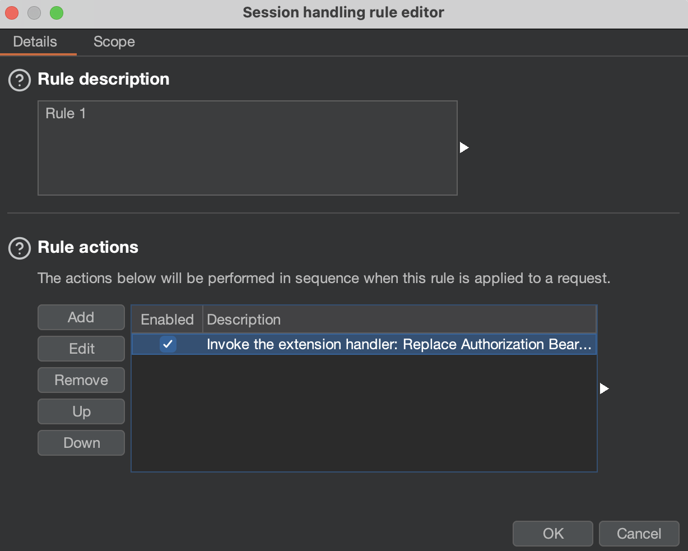

# Additional Burp Best Practices and Tips

## Searching for a specific string in all of Burp Suite

Let’s say you need to find a certain value or error string, but you can’t remember where you saw it (i.e., in which Burp tool).
Was it in Burp Repeater, Burp Scanner, Burp Target? To find it, use the global search in Burp Suite (accessible via **Burp** > **Search**):


The context menu to invoke the Burp Suite **Search** function



The global **Search** function in Burp


## Testing for race condition issues

Race conditions occur when the timing or ordering of events affects a system's behavior. In the context of web applications,
a race condition could occur if the application's security decisions depend on the sequence or timing of processed requests.
You can learn more about race condition issues on the [PortSwigger website](https://portswigger.net/web-security/race-conditions).

### Using Burp Repeater to test for race conditions

To conveniently detect race conditions, Burp allows you to group multiple requests and send them in a short time window.
So you can prepare multiple requests in Burp Repeater, send them almost simultaneously, and observe the system's behavior.

To group multiple requests in Burp Repeater, click the **+** sign and select **Add tab**:


Adding a tab in the **Repeater** tab


Then click on **Create new group** and select tabs (previously prepared requests) for the group:


Creating new group of Burp Repeater tabs


Then select **Send group (parallel)**:


The options for the group send in Burp Repeater


Burp will then send all grouped requests using the following techniques based on the HTTP version of requests:

- For HTTP/1 — last-byte technique
- For HTTP/2 — single-packet attack

You can find more information on specific attack types in the original research,
[Smashing the state machine: the true potential of web race conditions](https://portswigger.net/research/smashing-the-state-machine).

### Using Turbo Intruder to test for race conditions

You can also send multiple instances of a request in parallel using Turbo Intruder. Select the specific
request in Burp (e.g., from Burp Repeater), then right-click on the request
and choose **Extensions** > **Turbo Intruder** > **Send to Turbo Intruder**. Then select the example script, **`examples/race-single-packet-attack.py`**:


The example `race-single-packet-attack.py` Turbo Intruder script


Next, following comments in the chosen script, adjust the engine (line 8) to the number of queued requests in line 14,
click **Attack**, and observe the results.

If you need to differentiate specific parameters in requests, you can do the following:

1. Use Hackvertor tags in the request:

An example use of the Hackvertor tag in the requests in Turbo Intruder


2. Use the `%s` injection point (e.g., iterator `i` of the `for` loop). To configure the injection point, put the `%s` placeholder
in the request and edit the engine queue to include the iterator `i` as follows:

    ```py
    engine.queue(target.req, str(i), gate=’race1’):
    ```


The example injection point configuration in Turbo Intruder


This way, wherever you place `%s`, it will be replaced with an iterative number in the request.

### Using Backslash Powered Scanner for automated identification of potential race conditions

To automatically probe for potential race conditions in your target, you must enable the Backslash Powered Scanner
and run an active scan.

The following is an example issue raised by the extension in the **Issues** tab:


The example race condition issue raised by the Backslash Powered Scanner extension


## Testing for access control issues


You can learn about access control issues in [Access control vulnerabilities and privilege escalation](https://portswigger.net/web-security/access-control).


Access controls in web applications are typically defined by [user roles](https://en.wikipedia.org/wiki/Role-based_access_control).
For example, there may be regular end-user accounts and
administrator accounts. Each of these roles may have different access rights within the application. In this context, each role
should be validated on the server side based on the authorization cookie or header.
The [Autorize](https://portswigger.net/bappstore/f9bbac8c4acf4aefa4d7dc92a991af2f) extension is tailored to make testing access
controls in web applications flexible and efficient.

The general rule for using Autorize is to add the authorization cookie or headers of another application role to the extension,
configure optional detectors, and browse the application. When you go through the application, requests are resent with modified
parts (such as headers or cookies). We are essentially forging a different user role than what is expected.
Autorize automatically modifies and resends intercepted requests with these substituted session identifiers.
This allows us to investigate whether the server appropriately authorizes each incoming request, revealing any discrepancies in
access controls, such as a regular user accessing administrative functions. Also, it’s possible to check out the unauthenticated
perspective, where requests are sent without a specific header or cookie.

The Autorize table displays the request URL and enforcement status:


The example Autorize configuration with the results table


The following are useful tips when using the Autorize extension:

- Don’t forget to use the **Check Unauthenticated** functionality.
- Narrow down the source of the request sent to Autorize by setting up interception filters. For example, include only scope items
and ignore `OPTIONS` requests and other unnecessary requests from an authorization testing perspective.
- Always adjust the **Enforcement Detector** and **Detector Unauthenticated** functionalities accordingly to avoid missing bugs.
- Carefully review the results. Be aware of caveats. For example, some parameters in requests must be unique, so Autorize will not
analyze authorization issues properly because the application can return an error due to that uniqueness. To solve this problem,
you can use the Hackvertor extension in the original request sent to Autorize, and Autorize will process its tags.
To use Hackvertor tags in Burp Proxy, enable them in the settings by selecting **Allow tags in Proxy**:


The possible settings for the Hackvertor extension in Burp


References:

- [Autorize](https://github.com/PortSwigger/autorize): automatic authorization enforcement detection extension
- [Finding “BAC - IDOR -PE” Within a Minute using Autorize Tool](https://medium.com/@Cyber_siva/finding-bac-idor-pe-within-a-minute-using-autorize-tool-5aad4f0b563f)
- [Burp Suite tutorial: IDOR vulnerability automation using Autorize and AutoRepeater (bug bounty)](https://www.youtube.com/watch?v=3K1-a7dnA60)

If the Autorize extension is not enough for your target, try using the [AutoRepeater](https://portswigger.net/bappstore/f89f2837c22c4ab4b772f31522647ed8)
extension, which can automatically duplicate, modify, and resend any request. It also has many conditional replacement options.
For more information, see the following resources:

- [Burp Repeater - whether user permissions are working properly](https://security-szurek-pl.translate.goog/burp-autorepeater-czy-uprawnienia-dzialaja-prawidlowo/?_x_tr_sl=en&_x_tr_tl=pl&_x_tr_hl=en&_x_tr_pto=wapp)
- [BSides Rochester 2018 - AutoRepeater: Automated HTTP Request Repeating With Burp Suite](https://www.youtube.com/watch?v=IYFLp_4ccrw)
- [AutoRepeater: Automated HTTP Request Repeating With Burp Suite](https://github.com/nccgroup/AutoRepeater)

## Run Collaborator Everywhere

The Collaborator Everywhere extension adds noninvasive headers designed to reveal back-end systems by triggering pingbacks
to Burp Collaborator. You can also detect potential IP spoofing when the web application returns the potentially real IP address
based on the user-controlled header. However, the added headers may interfere with the normal functionality
of the web application. So you don’t need to have the extension enabled all the time, but we recommend taking at least one shot
in each corner of the application.

The Collaborator Everywhere extension adds appropriate headers and a payload to the `User-Agent` header in the in-scope proxy traffic:


The example request processed by the Collaborator Everywhere extension


For more information on exploitation issues raised by Collaborator Everywhere, see [Cracking the lens: targeting HTTP's hidden attack-surface](https://portswigger.net/research/cracking-the-lens-targeting-https-hidden-attack-surface).

## Responses can be intercepted/changed too

Even though we generally intercept requests and modify them to obtain specific results in Burp, intercepting HTTP responses can
be beneficial for the following reasons:

1. To analyze how the content is rendered in a mobile application
2. To remove/modify specific response headers (such as `Content-Security-Policy`)
3. To modify the response:

    a. [**Unhide hidden form fields**](https://portswigger.net/support/using-burp-to-bypass-hidden-form-fields)

    b. **Enable disabled form fields**

    c. **Remove input field length limits**

For example, to remove the `Content-Security-Policy` header from the response, under the **Match and replace rules** header,
select **Add**:


The Proxy settings in Burp that allow request and response modification



The example match/replace rule that removes the CSP header from a response’s headers


Then, in HTTP history, you can see a tick in **Edited**.

After selecting the request, choose the **Auto-modified response** to show that Burp removed the CSP header:


Showing the auto-modified response


Resources:

- [Using Burp Suite match and replace settings to escalate your user privileges and find hidden features](https://www.jonbottarini.com/2019/06/17/using-burp-suite-match-and-replace-settings-to-escalate-your-user-privileges-and-find-hidden-features/)

## Shutting down all tasks

If you want to shut down all tasks (e.g., active Burp Scanner, Burp Intruder) in Burp, you generally can use this power button:


Pausing all tasks in Burp’s Dashboard


The button pauses all tasks but does not pause running extensions. So if you have a running extension issuing requests,
they are still being sent. For example, when you use the Param Miner extension, you can see in Logger that when you
pause task execution, requests are still being sent.

If you want to pull the red emergency brake (i.e., pause all traffic), use the [Distribute Damage](https://portswigger.net/bappstore/543ab7a08d954390bd1a5f4253d3763b)
extension and select **pause all traffic**:


The configuration of the Distribute Damage extension that pauses all traffic


## BChecks

The standard library of passive and active scan checks in Burp is extensive. Also, all the available extensions
expand the library significantly. Nevertheless, what if you would like custom checks tailored to your organization or want
to hunt for a specific bug not covered by Burp? The simple solution is BChecks.

### What are BChecks?

The official documentation states the following:

> *BChecks are custom scan checks that you can create and import. Burp Scanner runs these checks in addition
to its built-in scanning routine, helping you to target your scans and make your testing workflow as efficient as possible.*

BChecks are written in a `.bcheck` file extension with a plaintext, custom definition language to declare the behavior of the check.
For more information, see [BCheck examples](https://github.com/PortSwigger/BChecks).

See the example, [`suspicious-input-transformation.bcheck`](https://github.com/PortSwigger/BChecks/blob/main/examples/suspicious-input-transformation.bcheck).
Taking a closer look at this BCheck file, we notice that this particular check is designed to identify suspicious input
transformation that might suggest the application is vulnerable to some kind of server-side code injection,
such as server-side template injection.

Here is what’s happening in `suspicious-input-transformation.bcheck`:

1. **metadata:** This section provides basic information about the BCheck.

2. **define:** This section defines two variables. The calculation variable is set to a string representation
of a mathematical calculation (`1337*1337`), and the answer variable is set to the result of that calculation (`1787569`).

3. **given insertion point then:** This is the start of the BCheck’s main logic.

4. **report issue:** This section describes the reported issue (severity, confidence, details, and remediation).



```yaml
metadata:
    language: v1-beta
    name: "Insertion-point-level"
    description: "Inserts a calculation into each parameter to detect suspicious input transformation"
    author: "Carlos Montoya"

define:
    calculation = "{{1337*1337}}"
    answer = "1787569"

# we will automatically insert into nested insertion points
given insertion point then
    # prevent false positives by checking answer isn't
    # already in base response
    if not({answer} in {base.response}) then
        send payload:
            appending: {calculation}

        if {answer} in {latest.response} then
            report issue:
                severity: high
                confidence: tentative
                detail: "The application transforms input in a way that suggests it might be
                         vulnerable to some kind of server-side code injection."
                remediation: "Manual investigation is advised."
        end if
    end if
```



### Why BChecks?

Crafting your extension to add custom checks is an option, but it's not a trivial process. It requires a significant amount
of time and expertise in programming. BChecks, on the other hand, offers a simpler solution. It allows you to automate your
passive and active hunts without extensive coding.

For example, you can [automate the search with a regex](https://karol-mazurek.medium.com/appsec-tales-xxii-ldapi-fcef1f40e9b2#:~:text=You%20can%20automate%20the%20search%20with%20the%20regex%20using%20BChecks)
to see if there is any information disclosing LDAP in use. This can be particularly useful if you're looking for potential
application information disclosure. With BChecks, you can set up this check once and run it automatically in all future scans.

### BChecks collection

For more examples of what you can do with BChecks, check out the [official BChecks collection](https://github.com/PortSwigger/BChecks)
for Burp Suite Professional. It can serve as a good starting point for creating your checks. You can learn from the examples
and modify them to suit your needs.

### BChecks for Organizations

BChecks are not only personal but can also be applicable across an entire organization. You can distribute the BChecks
(in the form of `*.bcheck` files) to team members, enabling everyone to look for the same bugs.

## Filtering the HTTP history with Bambdas

Bambda mode allows you to use small snippets of Java to customize your Burp tools. For example, the following [Bambda](https://github.com/PortSwigger/bambdas/blob/main/Filter/Proxy/HTTP/FindJSONresponsesWithIncorrectContentType.bambda)
allows you to find JSON responses with the wrong `Content-Type` in the HTTP history.


The example Bambda in the HTTP history


See more Bambdas in the [Bambdas collection on GitHub](https://github.com/PortSwigger/bambdas)
and read the documentation on [Filtering the HTTP history with Bambdas](https://portswigger.net/burp/documentation/desktop/tools/proxy/http-history/bambdas).

## Custom Hackvertor tags

The Hackvertor extension allows you to configure your own tags based on Python or JavaScript.

See this example usage:
<!-- markdownlint-disable no-inline-html line-length -->

<center><blockquote class="twitter-tweet"><p lang="en" dir="ltr">If you&#39;re testing a site that needs a unique CSRF-token for each call, you can use Hackvertor&#39;s custom tags to make a simple python script to fetch a new token for you. Very simple solution and works very nicely. Thank you again <a href="https://twitter.com/garethheyes?ref_src=twsrc%5Etfw">@garethheyes</a>!<a href="https://t.co/nd2cxTPQiL">https://t.co/nd2cxTPQiL</a> <a href="https://t.co/Vlp1Anxeqk">pic.twitter.com/Vlp1Anxeqk</a></p>&mdash; Frans Rosén (@fransrosen) <a href="https://twitter.com/fransrosen/status/1361594153268871168?ref_src=twsrc%5Etfw">February 16, 2021</a></blockquote> <script async src="https://platform.twitter.com/widgets.js" charset="utf-8"></script></center>

<!-- markdownlint-restore -->
Also see the official Hackvertor tag store:


The Hackvertor tag store that is accessible from Burp’s top menu bar


## Leveraging Easy Auto Refresh Chrome extension with Burp

Combine the [Easy Auto Refresh](https://chromewebstore.google.com/detail/easy-auto-refresh/aabcgdmkeabbnleenpncegpcngjpnjkc)
Chrome extension with Burp for the easiest way to extend your session and prevent automatic logout. Just set the appropriate
refresh time in the extension and proxy the traffic through Burp. The site should keep you logged in. If the cookies change,
Burp’s cookie jar will automatically update the cookies in the appropriate requests issued by Burp Scanner.


The Easy Auto Refresh popup in Chrome browser


If the refresh action in the target site automatically goes through the entire authentication flow and obtains
a new `Authorization: Bearer` token required by the target, you can install the Authorization Bearer Detector and Replacer
custom extension (figure 22). This will avoid the situation where the authorization header expires and requests sent by Burp
return a “401 Unauthorized” error. The extension reads the authorization header from traffic proxied by the browser and replaces
it when the old header expires in requests sent by Burp.

To make it work, install the extension (figure 23), edit the target hostname (line 19), and add a new session handling rule
to enable the custom extension in Burp Scanner and Burp’s extensions. In Burp’s settings, go to the **Sessions** tab and add
a new session handling rule. In **Rule actions**, select **Add** and **Invoke a Burp extension**, then select
the **Replace Authorization Bearer Token** in the extension action handler. In the **Session handling rule editor** window,
go to the **Scope** tab and select the **Scanner** and **Extensions** in the **Tools scope**.



The session handling rule configuration




```python {linenos=inline}
from burp import IBurpExtender, IProxyListener, IHttpRequestResponse, IExtensionHelpers, ISessionHandlingAction, IRequestInfo
from java.util import ArrayList
from java.net import URL

class BurpExtender(IBurpExtender, IProxyListener, ISessionHandlingAction):
    def registerExtenderCallbacks(self, callbacks):
        self._callbacks = callbacks
        self._helpers = callbacks.getHelpers()
        callbacks.setExtensionName("Authorization Bearer Detector and Replacer")
        callbacks.registerProxyListener(self)
        callbacks.registerSessionHandlingAction(self)
        self.previous_token = None
        print("Authorization Bearer Detector and Replacer extension loaded.")

    def processProxyMessage(self, messageIsRequest, message):
        if messageIsRequest:
            http_service = message.getMessageInfo().getHttpService()
            url = URL(http_service.getProtocol(), http_service.getHost(), http_service.getPort(), "")
            if url.toString().startswith("https://XX.com"):
                request = message.getMessageInfo().getRequest()
                headers = self._helpers.analyzeRequest(request).getHeaders()
                for header in headers:
                    if header.startswith("Authorization: Bearer"):
                        token = header.split(" ")[2]
                        if self.previous_token != token:
                            print("New Authorization Bearer found in a request to " + url.toString() + ": " + token)
                            self.previous_token = token
                            self.replaceToken(message.getMessageInfo())

    def replaceToken(self, messageInfo):
        request = messageInfo.getRequest()
        requestInfo = self._helpers.analyzeRequest(request)
        headers = requestInfo.getHeaders()
        newHeaders = []
        for header in headers:
            if header.startswith("Authorization: Bearer"):
                newHeader = "Authorization: Bearer " + self.previous_token
                newHeaders.append(newHeader)
            else:
                newHeaders.append(header)
        newRequest = self._helpers.buildHttpMessage(newHeaders, request[requestInfo.getBodyOffset():])
        messageInfo.setRequest(newRequest)

    def getActionName(self):
        return "Replace Authorization Bearer Token"

    def performAction(self, currentRequest, macroItems):
        self.replaceToken(currentRequest)
        return None
```



## Configuring an upstream proxy in Burp Suite

### Proxy chaining

Some web applications require traffic to be routed through a predefined proxy. In such scenarios, configuring our browser with the
predefined proxy for the destination web server will prevent intercepting traffic with Burp Suite. To solve this issue, Burp Suite
allows the configuration of an upstream proxy, enabling you to intercept traffic with Burp and forward it to the proxy used to
access the web application.

Upstream proxies are also useful when using several web application testing tools. For example, Burp Suite can be chained with
[Zed Attack Proxy (ZAP)](https://www.zaproxy.org/) or a custom automation script built upon [mitmproxy](https://mitmproxy.org/).
Chaining proxies allows us to leverage the strengths of each tool simultaneously during testing.

### Configuration in Burp Suite

To configure an upstream proxy, go to **Settings** > **Network** > **Connections** and scroll down to the
**Upstream proxy servers** section. Click **Add** to configure a new upstream proxy. In the pop-up window, specify the destination
host, the proxy host or IP address, and the proxy port. If the proxy requires authentication, further specify
authentication-relevant information such as the authentication type, username, and password.

### Proxying Burp through ZAP

In the following example, Burp is proxied through ZAP. Burp listens on `localhost:8080`, while ZAP listens on `localhost:8081`.
Burp is configured with ZAP as an upstream proxy. In the configuration below, traffic to all hosts is proxied to ZAP:


The example configuration of the upstream proxy rule


In Burp Suite's built-in browser, opening `trailofbits.com` appears as follows:


Burp’s built-in browser showing the website that is also proxied through ZAP, with ZAP’s HUD added to the website


Note the new elements on the sides of the browser. ZAP injects these elements into the page to provide a heads-up display (HUD).
Looking into Burp Suite's HTTP history, we also find the corresponding requests to `trailofbits.com`.
